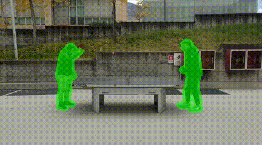

# Multi-Prompt-Video-Inpainting
Project for the 'Advanced Computer Vision' course of the Master's Degree in Artificial Intelligence Systems at the University of Trento, A.Y. 2023/2024.

## Description

Pre-Trained Models For Multi-Prompt Object Removal in Video Sequences
In this [Project](ADV_CV_Propainter.pdf) we explored the chain capabilities of some well established models. The first one is [GroundingDINO](https://github.com/IDEA-Research/GroundingDINO) for Visual Grounding task, then [SAM](https://segment-anything.com/) will perform segmentation of video sequence masks while the final one is [ProPainter](https://shangchenzhou.com/projects/ProPainter/) for video inpaiting.
The synergy between the two models will achieve multi-textual-prompts video impainting.

## Results
**Prompt:** *The person on the right and the person on the left*

#### Multi-Prompt Visual Grounding (GroundingDINO)
<table>
<tr>
   <td> 
      
   </td>
</tr>
</table>


#### Mask Sequences Segmentation (SAM)
<table>
<tr>
   <td> 
      
   </td>
</tr>
</table>

#### Video Inpainting (ProPainter)
<table>
<tr>
   <td> 
      
   </td>
</tr>
</table>

## Installation
1. To avoid possible conflicts, it is recommended to use a **virtual environment** to install the required packages. 
    ```
    python3 -m venv venv
    source venv/bin/activate
    ``` 

2. To install the project, clone the repository and install the required packages with the following command:
    ```
    pip install -r requirements.txt
    ```
    
3. Before running the program make sure to clone the official repository from the [ProPainter's official github page.](https://github.com/sczhou/ProPainter)
    ```
    git clone https://github.com/sczhou/ProPainter.git
    ``` 

4. Before running the program make sure to clone the official repository from the [GroundingDINO's official github page.](https://github.com/IDEA-Research/GroundingDINO)
    ```
    git clone https://github.com/IDEA-Research/GroundingDINO.git
    ``` 

5. Before running the program make sure to download SAM's pretrained weights and GroundingDINO's pretrained weights. 
   **Note** remember to store all the downloaded weights inside the ```weights``` folder.
    ```
    wget -q https://dl.fbaipublicfiles.com/segment_anything/sam_vit_h_4b8939.pth
    wget -q https://github.com/IDEA-Research/GroundingDINO/releases/download/v0.1.0-alpha/groundingdino_swint_ogc.pth
    ``` 

## How to run the program

The program can be run with the following command:

    ```
    python3 prompt_removal.py -v <video.mp4> 
    ```
    ```
    python3 prompt_removal.py -v <video.mp4> [-h_res <True>] [-display <False>] [-box_t <bbox threshold>] [-text_t <text threshold>]
    ```

  - Help:
      ```
      python3 <program.py> -h
      ```

**Note:** The video result of the inpainting will be saved in the folder ```results```.

## Authors
[Giovanni Scialla](https://github.com/MisterMandarino) [Mattia Nardon](https://github.com/Mattia-Nardon)
 
